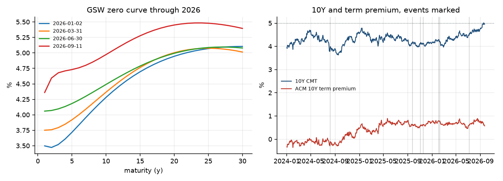
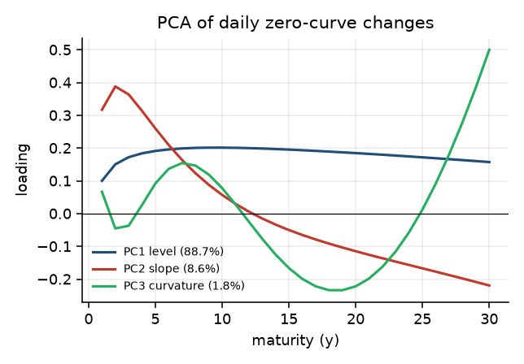
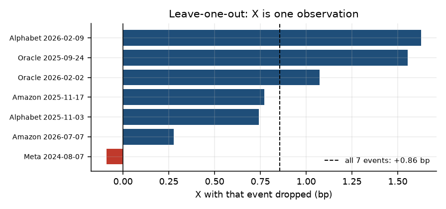

# Trying to find AI debt in the Treasury curve

> **Superseded.** This was the first narrative writeup, from 18 September. Several numbers below predate the adversarial review and
> the fixes of 23 September 2026. Current numbers are in
> [`research/03_FINDINGS.md`](research/03_FINDINGS.md); the long-form writeup is
> [`POST.md`](POST.md).

Notes on a project where most of the work was figuring out which questions the
data could actually answer.

## The question

In 2026 the five big AI capex spenders issued $179.5B of USD bonds. In 2025 it
was $92.8B. Before that, close to nothing. Over the same stretch the 10Y went
from 4.19% to 5.00%, crossing 5% on 15 September for the first time since 2007.
Sell-side research put roughly 30bp of that on corporate and MBS supply.

That claim has testable structure. If supply is doing the work, it should show up
in the term premium rather than in expected short rates, and it should be
concentrated at the maturities issuers actually sell into. Two clean predictions.
I wanted to check both against primary data, free sources only.

## Part 1: getting the deals out of EDGAR

This was the part I expected to be tedious and it was, but it is also the part
that worked, and in hindsight it is the only part of the project nobody could
regenerate from a database.

Bond offerings show up on EDGAR in three documents and you need all three:

- The **preliminary 424B** is filed on announcement morning. Every dollar amount
  is blank. Useless for sizes, perfect for timing.
- The **FWP pricing term sheet** is filed the same afternoon with a literal
  `Trade Date:` field and the priced tranches.
- The **final 424B** lands a day or two later with the authoritative table on its
  cover: `$5,000,000,000 4.250% NOTES DUE 2031`, one line per tranche.

So: sizes from the final, dates from the FWP. I matched the two on the full set
of coupon rates. All 16 USD deals matched at 1.00, which is the kind of check
that either works completely or tells you your parser is broken.

Things I only found by reading the documents:

- Oracle's February 2026 filing is a mandatory convertible preferred, not a bond.
  Alphabet did one in June. Neither is duration supply.
- Microsoft's only hit in the window is a 424B3 for an Activision debt exchange.
  Microsoft issued no new public USD bonds at all over three years.
- Alphabet's May 2026 deal is a yen samurai. Amazon's March 2026 has a euro twin
  filed one day after the dollar deal. $34.8B equivalent of the total is non-USD,
  which supplies duration to bunds, gilts and JGBs.
- Amazon's $37B March deal has 11 tranches, two of them floaters. A floater
  resets quarterly, so its rate duration is about 0.25y, not its maturity.
  Counting notional instead of duration would have put $2.75B of phantom duration
  into the largest event in the sample.

Everything gets converted to 10-year equivalents, which is notional times
modified duration over the duration of a 10Y par bond. That is the unit that
makes a $5B 30-year comparable to a $5B 3-year.

The validation that made me trust the pipeline: 2025 USD issuance comes out at
$92.75B against a widely quoted ~$93B. The 2026 figure came out at $179.5B
against a commonly quoted ~$132B, which I think is the quoted figure being wrong
rather than mine, though I can't prove that.

## Part 2: the filter that deleted the sample

The design said to drop any deal within three business days of FOMC, CPI or
payrolls, on the reasonable grounds that you can't separate a supply shock from
a macro shock. Fine. I wrote it down before looking at anything.

Applied literally it left **one event out of twelve**.

My first instinct was that the macro calendar is just dense. It isn't dense
enough: 37% of business days in the sample are clean under that rule, so random
timing should retain four or five of twelve. Only one survived.

The actual reason is that issuers are not timing randomly. Of the eleven deals
dropped, eight price within three business days *after* a release. Treasurers
deliberately wait for the print, then bring the deal into the clean air behind
it. So a symmetric three-day filter is close to a filter on issuance itself. The
exclusion rule and the thing being measured are not independent.

I switched to a narrower rule: drop a deal only if a release falls inside the
t−1 to t+1 window actually being measured. That is the version of the concern
that has teeth, and a curve-wide macro shock gets removed by the residualisation
anyway. The ladder:

| rule | N |
|---|---|
| ±0 bdays | 11 |
| **±1 (used)** | **7** |
| ±2 | 6 |
| ±3 (as designed) | 1 |

This is a specification change made after seeing what the original did. I report
it that way. It is the first of several.

## Part 3: the estimator that could not have worked

The core measurement was supposed to be: take the event-window change in the
zero curve, project it onto the first three PCA loading shapes using only tenors
far from the deal's tranches, and read the residual at the tenors the deal
actually issued into. A local bump means a localised concession.

The PCA itself is textbook. 88.7 / 8.6 / 1.8 percent, cumulative 99.2, loadings
flat then monotone then humped.

Run the concession and you get +0.077bp with a placebo p-value of 0.68. Nothing.

The tell was in the diagnostics: the control-tenor fit had R² = 1.000. Not 0.999.
GSW is a six-parameter Svensson curve, and three principal components span
essentially all of it, so residuals live below a basis point by construction.

At that point you can either report a null or find out whether your instrument
can see anything. I injected a known 5bp Gaussian bump at each deal's tenors and
measured what came back out.

- 3-factor residualisation alone recovers **77.7%** of the bump. The estimator is
  fine.
- Re-fitting Svensson the way the Fed does before publishing GSW drops recovery
  to **−10.7%**. The smoothing doesn't shrink a local bump, it redistributes it
  and flips the sign of the residual at the target tenors.

So the published curve destroys the signal before I ever see it. The FRED par
grid is no escape: eight usable tenors, deals targeting six of them, and a ±2y
exclusion band leaves 0.86 control tenors on average against four parameters.

The experiment also made an out-of-sample prediction, which then came true: if
the estimate is noise, its sign should move with the control definition. It does.
The measured concession runs from −0.167bp (band 4y, t = −2.20) to +0.123bp
(band 3y, t = +3.16). A real effect doesn't do that.

This is my favourite part of the project. Proving a method can't work is a
result, and it is much more defensible than reporting its null.

## Part 4: what the data could answer

Smooth curves can still tell you whether the sector a deal sells into cheapened
more than the front end and breakevens imply, as long as you residualise in the
time series rather than across the curve. Fit the normal relation on 625
non-event three-day windows, then read the event residual.

That gives **X = +0.82bp**, duration-weighted over seven events. Right sign,
NW t = 0.93, placebo p = 0.62. The placebo distribution has sd 1.70bp, so with
N = 7 the minimum detectable effect is 3.3bp at 95% and 4.7bp for 80% power. An
effect of 1 to 3bp, which is what this should be, sits under the noise floor.

The term premium leg was more interesting. Regressing the daily change in the ACM
10Y term premium on announced duration gives +0.085bp per $bn of 10-year
equivalents. Local projections say how long it lasts:

Sharp at h = 0 to 2, gone by h = 5, wide bands after. Scaled by 2026 issuance
that is 15.6bp of announcement-day impact across the year and about 2bp that
survives a week. Reads like dealer inventory: intermediaries absorb duration,
they want paying for it, the compensation decays as paper distributes.

## Part 5: then I tried to break it

The useful phase. Roughly in order of how much damage each did.

**X is one observation.**

Drop Meta 2024-08-07 and X goes from +0.82 to −0.12. That event has an abnormal
move of +8.88bp against a −3.4 to +3.5 range for the other six, and it sits
inside the August 2024 yen-carry unwind. VIX hit 38.57 on 5 August and was still
27.85 on the event date, the 97th percentile of the sample. X is that week.

**The headline framing didn't survive endpoints.** Calendar 2026 shows the term
premium falling 8.6bp while expected short rates rose 79bp, which I had written
up as "the selloff cannot be a supply story." Then I varied the endpoints.

ΔTP ranges from −29 to +24bp and is positive in 12 of 25 window pairs. Worse,
over the full 2024 to 2026 sample the 10Y rose 105bp of which **+103bp is term
premium** and −1.7bp is expectations. The exact opposite. My conclusion was an
artifact of picking calendar 2026, and over the horizon where the AI issuance
ramp actually happened the term premium is the whole story, which makes the
supply hypothesis more plausible rather than less.

**The t-stat was softer than advertised.** NW t = 3.42 on the announcement
effect. But plain OLS gives t = 1.92, and the HAC correction *shrinks* the
standard error below OLS, which is a warning sign. A randomization test with
1000 draws gives a placebo sd 1.9x the Newey-West one and **p = 0.069**. The Kish
effective n of the daily regressor is 9.6, not 673, because 95% of its variation
sits in 16 days. It does survive leave-one-out (+0.067 to +0.093, min |t| = 2.59)
and a wild cluster bootstrap (p = 0.017).

**The mechanism has a hole.** In the same regression, Treasury coupon duration
supply, about 10x larger, has a coefficient of −0.0014 with t = −0.15. If
duration absorption raised term premium, the bigger supplier should dominate. It
doesn't and the signs differ. And ΔACM TP10 is 96% explained by five PCs of the
same zero curve, so the dependent variable is close to a fixed linear function of
the long-end move it is being asked to explain.

## Scorecard

Worked:

- Document-level parsing with the FWP/424B cross-match. 100% coupon match, and
  an external validation at $92.75B.
- Measuring the instrument before trusting it. The injection experiment saved me
  from reporting a meaningless null as a finding.
- Local projections instead of a decayed-stock regression. The stock formulation
  mean-reverts, so it reported a cumulative effect near zero and hid a real
  impact effect that decays.
- Randomization tests. They disagreed with the analytic standard errors and they
  were right to.

Didn't:

- **The NLP index.** TF-IDF into truncated SVD, scored against a direction vector
  from labelled passages, decayed into a daily series. It runs. Its corpus is 716
  effectively distinct passages after deduplication, from 68 filings, and 82% of
  the raw corpus has a near-duplicate at cosine 0.90 because 10-Qs restate the
  same MD&A every quarter. It produced a wrong-signed coefficient, and a plain
  decayed passage count beat it (t = +2.86 versus t = −1.20). Calling it an NLP
  index oversells what it is.
- **The HMM.** Three states on 673 days of curve factors gives a rally state, a
  calm state and a two-day volatility state. Breakevens co-move with yields at
  ~0.6 in all three, so it never separates inflation-led from supply-led. BIC
  can't tell K = 2 from K = 3 (−4332.1 versus −4332.5).
- **Multiplicity.** 16 regression specs, 16 event-study rows, and I highlighted
  the significant one. No correction applied. The design doc warned about exactly
  this and I did it anyway.

## What I'd do differently

Measure the instrument first. The recovery experiment took an afternoon and it
should have come before the estimator, not after the null. Same for the macro
filter: simulating how many events a ±3 day rule retains is ten lines and would
have caught the problem on day one.

Vary endpoints before writing a conclusion, not after. The "it's all
expectations" line survived into a full writeup before I checked whether it was a
property of the data or of the window I picked.

And cut the NLP leg. It was the weakest component, it consumed a disproportionate
share of the time, and its most useful output was learning that a sentence
counter beats it.

## The honest summary

A marginally significant, clearly transitory long-end response to jumbo AI
issuance, around 0.08bp per $bn of 10-year equivalents on announcement, gone
within a week. No identified term premium mechanism, since Treasury supply of the
same kind does nothing in the same regression. No test at all of most of the
supply the 30bp claim refers to, because agency MBS has no free daily series.
And no ability to measure maturity-localised concession from published curves,
which needs TRACE or CRSP.

Reproduce it with `src/data_pull.py` onward. The audit scripts are
`src/audit1_lags.py` through `audit6_nlp_real.py`. Numbers in this post come from
`output/tables/headline.json` and the audit script output.
