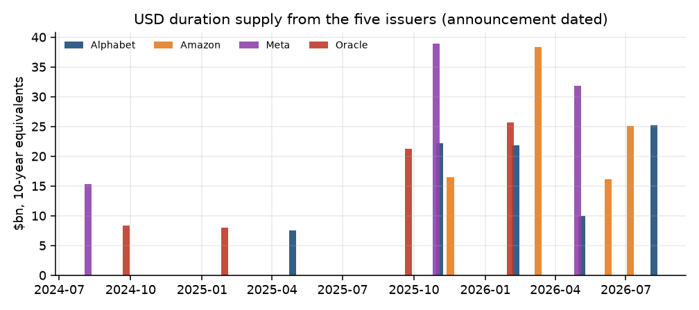
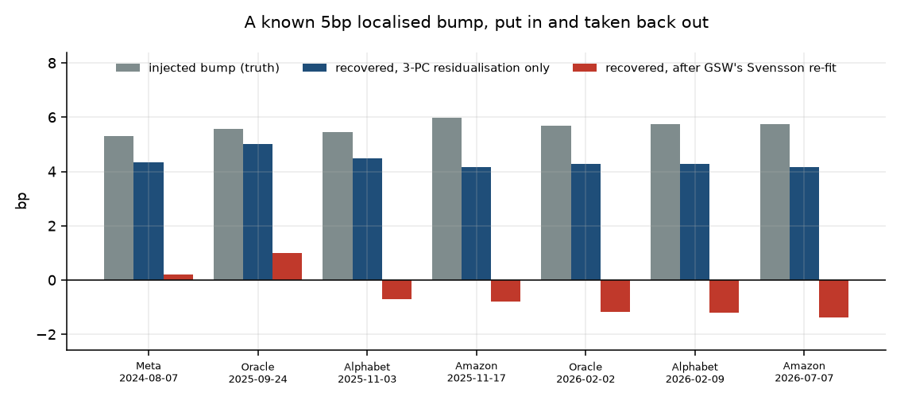
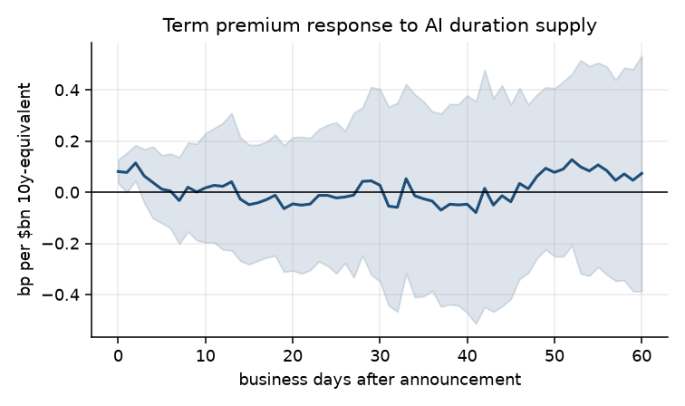
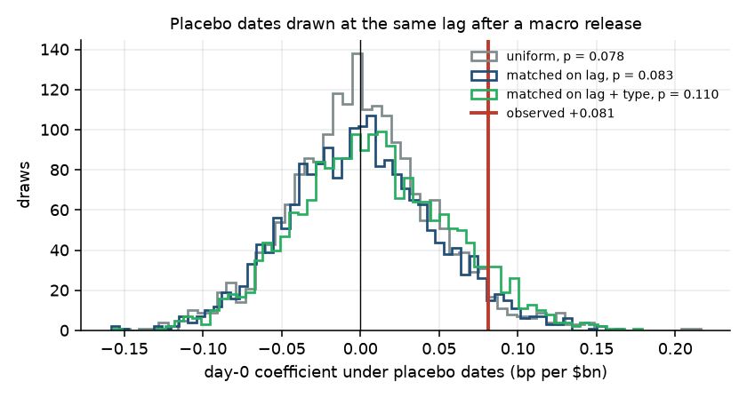
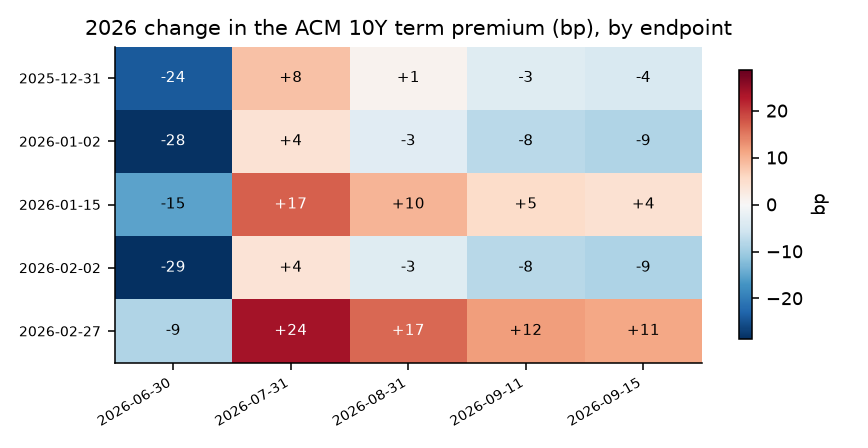
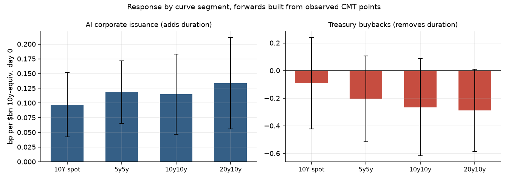
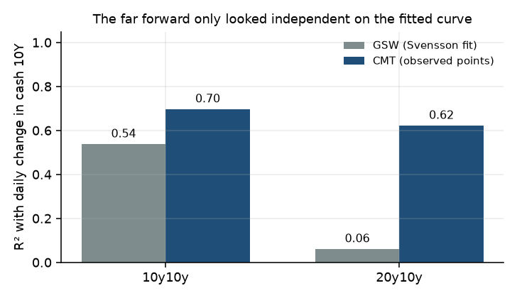
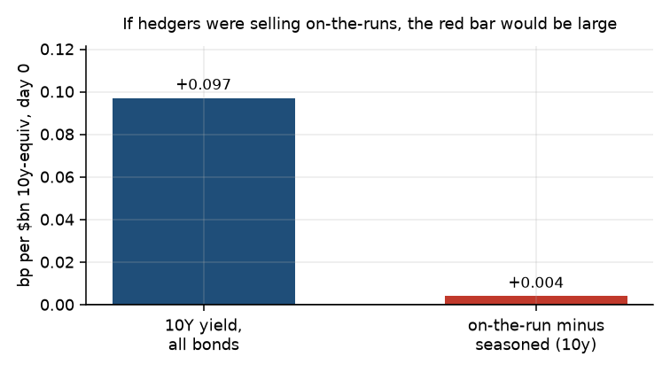
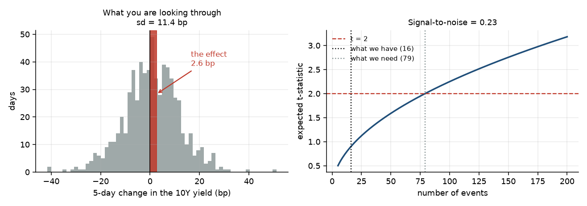

# I tried to find AI debt in the Treasury curve

Aarav Raina · September 24, 2026 · 21 min read

On September 15 the 10-year Treasury yield closed at 5.00% for the first time since July 2007. A week later it was trading above 5.1%. Around the same time I read a sell-side estimate that roughly 30 basis points of the 2026 selloff came from corporate and mortgage bond supply.

That is a specific, falsifiable claim, and as far as I could tell nobody had published the work behind it.

Meanwhile the five big AI spenders (Amazon, Alphabet, Meta, Microsoft, Oracle) had issued $179.5 billion of dollar bonds in 2026, up from $92.8 billion in 2025 and close to nothing before that. Every one of those bonds is duration that somebody has to hold. If corporate supply moves Treasury yields, this is where you would look.

So I spent a couple of weeks trying to measure it, using only free data.

The headline result is small and mostly negative. The interesting part is everything that broke on the way there, and specifically the afternoon I spent proving that my own main estimator was incapable of answering the question I had pointed it at.

> *Basis point (bp).* One hundredth of a percentage point. A yield going from 4.94% to 5.00% moved 6bp. Bond people speak entirely in these.

> *Term premium.* A 10-year yield is roughly two things added together: what people expect short rates to average over the next ten years, and the extra compensation they demand for locking money up for a decade instead of rolling overnight. The second part is the term premium. It is the part that supply and demand should move, which is why the whole project lives there.

## Getting the deals out of EDGAR

There is no free database of corporate bond deals with announcement timestamps. There is EDGAR, which has the filings, and you have to build the database yourself.

A bond offering shows up as three documents, and you need all three because each one is missing something the others have:

- The preliminary prospectus (form 424B) is filed the morning of the deal. It lists the tranches but every dollar amount is blank. Useless for size, perfect for timing.
- The FWP pricing term sheet is filed the same afternoon. It has a literal `Trade Date:` field and the priced sizes.
- The final prospectus lands a day or two later with the authoritative table on the cover: `$5,000,000,000 4.250% NOTES DUE 2031`, one line per tranche.

So: sizes from the final, dates from the FWP. I matched the two by comparing the full set of coupon rates in each, which is a nice check because a bad match shows up as a partial score rather than silently passing. All 16 deals matched at 1.00.

If you skip this and use the final prospectus filing date as your event date, you have introduced a two-day look-ahead into an event study. That is the kind of bug that quietly destroys a result rather than announcing itself.

Things I only found by actually reading the documents:

- Oracle's February filing is a mandatory convertible preferred, not a bond. Alphabet did one in June. Neither supplies duration.
- Microsoft's only hit in three years is a debt exchange for Activision paper. Microsoft has issued no new public dollar bonds in the entire window, which surprised me.
- Alphabet's May deal is a yen samurai. Amazon's March deal has a euro twin filed one day after the dollar one. $34.8 billion equivalent of the total is non-dollar, and that supplies duration to bunds and gilts, not Treasuries.
- Amazon's $37B March deal has 11 tranches, two of them floating rate. A floater resets its coupon every quarter, so its interest-rate duration is about three months, not eight years.

The general point matters more than that example. The whole project is denominated in duration, not dollars.

```
D_t  =  sum over tranches j of  ( notional_j  x  ModDur_j )  /  ModDur_10Y
```

This converts every deal into "how many billions of 10-year notes would carry the same interest rate risk." A $5B 30-year tranche is worth roughly twice a $5B 10-year. The floaters turned out not to matter much here: only 7 of 103 tranches are floating, and treating them as anything from zero to two years of duration moves the main result in the fourth decimal place.

> *Duration.* How much a bond's price moves when yields move. A 10-year note has duration around 8, meaning a 1% rise in yields costs you about 8% of the price. It is the natural unit for "how much interest rate risk is this."

*Figure 1. USD duration supply from the five issuers, dated to announcement rather than filing. Nothing before mid-2024, then a step up through 2025, then 2026.*



One number gave me confidence the parser was right: my 2025 total came out at $92.75 billion against a widely quoted figure of about $93 billion. My 2026 number, $179.5 billion, is well above the ~$132 billion I have seen quoted, and I think the quoted figure is the wrong one.

## The first thing that broke

The research design said: drop any deal that prices within three business days of an FOMC meeting, a CPI print, or a payrolls release. You cannot separate a supply shock from a macro shock, so throw those out. Sensible. I wrote it down before touching any yield data.

Applied literally, it left one event out of twelve.

My first assumption was that the macro calendar is just crowded. It is not crowded enough to explain this. Under a three-day rule, 37% of business days in my sample are clean, so random timing should have kept four or five deals out of twelve. One survived.

The actual reason is that treasurers are not timing randomly. Of the eleven deals the filter killed, eight priced within three business days after a macro release. They wait for the print, then bring the deal into the clean air behind it.

Which means the exclusion rule and the thing I was trying to measure are not independent. A symmetric three-day filter around macro events is very close to a filter on corporate issuance itself.

I switched to a narrower rule: drop a deal only if a release lands inside the three-day return window I am actually measuring. That is the version of the concern with teeth, and a market-wide macro shock gets removed by the statistical controls anyway.

| Exclusion rule | Events surviving |
|---|---|
| same day only | 11 |
| inside the return window (used) | 7 |
| ±2 business days | 6 |
| ±3 business days (as designed) | 1 |

This is a specification change I made after seeing what the original did, and I report it that way everywhere. It is the first of several.

## Wait, can this method even work?

The core measurement was supposed to be a "concession": when a company sells a lot of 10-year paper, does the Treasury curve cheapen *specifically* around the 10-year point, beyond whatever the whole curve did that day?

The way you test that is to take the day's change in the yield curve, fit it using only the maturities the deal did not touch, then look at what is left over at the maturities it did touch.

```
dy(tau)  =  a  +  b*f1(tau)  +  c*f2(tau)  +  d*f3(tau)  +  e(tau)
```

where f1, f2 and f3 are the three standard shapes a yield curve moves in (level, slope, curvature, which together explain 99.2% of daily variation). Fit that on the far-away maturities, predict at the deal's maturities, and the residual is your concession.

> *Yield curve factors.* If you look at how the whole curve moves day to day, almost all of it is three patterns: the whole thing shifts up or down (level), the short end and long end move apart (slope), and the middle moves against the ends (curvature). Everything else is noise.

I ran it. The answer was +0.077bp, with a placebo p-value of 0.68. Nothing.

Before writing that up as "no localized effect exists," I looked at the diagnostics. The fit on the control maturities had an R-squared of 1.000. Not 0.999.

That is not a good sign. That is the model explaining the control points perfectly, which means there is no room left for a residual anywhere.

The curve I was using is the Fed's published zero-coupon curve, which is itself a smooth six-parameter function fitted to bond prices. Three factors span almost all of a six-parameter family. So the residual I was hunting for lives below a basis point *by construction*.

Rather than argue about this, I tested it. I took real daily curve moves, injected a known 5bp bump at each deal's maturities, and measured how much of it came back out the other end.

*Figure 2. Inject a known 5bp bump, see what the estimator returns. Grey is the truth, blue is after the statistical step, red is after the Fed's own smoothing is applied first.*



| Stage | How much of the bump survives |
|---|---|
| The three-factor step alone | 77.7% |
| After the Fed's curve-fitting is applied first | −10.7% |

The statistical method is fine. It recovers three quarters of a real bump. The problem is that the published curve is smoothed *before I ever see it*, and that smoothing does not just shrink a local bump. It redistributes it and flips the sign of what is left at the target maturities.

This made a prediction I could check: if the estimate is noise, its sign should wander when I change the control definition. It does. The measured concession swings from −0.167bp to +0.123bp as I move the exclusion band by a couple of years, and both ends are "significant."

So the honest conclusion is not "there is no localized concession." It is "this data cannot detect one, and here is the experiment proving it." Measuring it properly needs transaction-level bond data, which is paid.

That afternoon was the most useful one of the project. Measure what your instrument can see before you trust a null from it.

## What I found instead

None of the underlying idea is new. Greenwood and Vayanos (2014) showed Treasury supply moves term premia, and Vayanos and Vila's preferred-habitat model (2021) is the theory for why supply at a maturity should move yields at that maturity. What's new here is the supply source.

Smooth curves cannot tell you whether a bump is local in maturity. They can tell you whether the long end moved more than the front end and inflation expectations imply, because that compares the same smooth number across event days and normal days, and the smoothing cancels out.

That works. And the more interesting version is to ask how long it lasts, using local projections: a separate regression for each horizon h, from zero to sixty days after the announcement.

```
TP(t+h) - TP(t-1)  =  a_h  +  b_h * shock_t  +  controls  +  error
```

`b_h` is the effect h days later, per billion dollars of 10-year-equivalent duration announced.

*Figure 3. The term premium response to announced AI duration supply, with 95% bands. Sharp for two days, gone by five.*



| Days after announcement | Effect (bp per $bn) | t |
|---|---|---|
| 0 | +0.081 | 3.47 |
| 2 | +0.115 | 3.24 |
| 5 | +0.013 | 0.19 |
| 20 | −0.045 | −0.34 |

Real on impact, dead within a week. Scaled by 2026 issuance that is about 16bp of announcement-day effect across the whole year and roughly nothing that persists.

That already answers the 30bp claim, at least for this slice of supply. Whatever moved the long end in 2026 for a year, it was not corporate deals leaving a permanent mark.

## Then I tried to break it

I ran an adversarial pass on my own results, then a second, harsher one a few days later. Most of what follows came out of those.

**The t-statistic was softer than it looked.** Newey-West gave me t = 3.47. But plain OLS gives t = 1.97, and a randomization test (shuffle the event dates two thousand times, keep the deal sizes, see how often you get a coefficient this big) gives p = 0.078.

The tell was something I should have caught immediately: the Newey-West standard error was smaller than the OLS one, 0.0230 against 0.0442. Newey-West is a correction for correlated errors. When your correction makes your error bars tighter, it is exploiting something, and with a regressor that is 16 lumpy shocks it is not a correction worth trusting.

> *Newey-West.* A standard fix that widens your error bars when your data points are correlated over time. Everyone in finance uses it reflexively. It assumes your sample is big and spread out, which mine is not.

The regressor has 680 daily observations, but 95% of its variation sits in 16 days. The effective sample size is about 10.

**The placebo was ignoring the calendar.** Shuffling event dates uniformly assumes the real dates are random. They aren't. Remember that treasurers price just after macro releases: 9 of the 16 deals land one to three days after an FOMC decision, CPI print or payrolls number. And in this sample the term premium does tend to drift up in those days, about +0.7bp on the release day itself. So maybe my "effect" was just deals inheriting post-release drift.

The fix is to draw every fake date at the same distance after a macro release as the real deal it replaces.

*Figure 4. The day-0 coefficient under three kinds of placebo dates, against the real one in red.*



| Placebo | Mean | p |
|---|---|---|
| uniform | +0.001 | 0.078 |
| same lag after a release | +0.000 | 0.083 |
| same lag and same release type | +0.008 | 0.110 |

The matched placebo stays centred on zero, so the drift doesn't produce the announcement-day effect. The p-value gets a little worse, which is the honest direction for it to move. It did explain part of something else though: about half of the day-2 "peak" in the impulse response reappears under matched placebo dates, so some of that was drift after FOMC meetings.

**The endpoint result was wrong.** I had written that the 2026 term premium fell 8.6bp while expected short rates rose 79bp, so the selloff could not be a supply story. Then I varied the start and end dates.

*Figure 5. The 2026 change in the term premium, for 25 combinations of start and end date. Blue is negative, red is positive.*



It ranges from −29bp to +24bp and is positive in 12 of the 25 windows. Moving the end date forward one week, past the Fed's 16 September hike, takes it from −8.6bp to −21.9bp. And over the full 2024 to 2026 sample the 10-year rose 105bp of which +103bp is term premium. The exact opposite of the calendar-2026 cut I had picked.

So a claim I had already written into a document was an artifact of the window I chose. I kept the original text and added a correction rather than quietly editing it.

**What survived.** The core coefficient held up. Leave-one-out across all 16 deals gives a range of +0.068 to +0.094 with a minimum t of 2.63, dropping all three pairs of deals that overlap gives +0.091, and a wild cluster bootstrap gives p = 0.012. It is the one result I still stand behind, at p around 0.08 rather than the 0.001 I originally thought.

## The satisfying part

If this is really about duration absorption, then somebody *removing* long duration should move the same numbers the other way. Treasury does exactly that: it runs buyback operations in the same market, at daily frequency, and in September it doubled the size of its 10-to-30-year buybacks.

So I ran the identical regression on Treasury's long-end buyback operations, with the prediction written down first: the coefficient should be negative. It is, −0.20 per $bn.

There's a catch I missed the first time. Buyback dates and maximum sizes are announced in advance, and three quarters of long-end operations fill exactly to that maximum, so only about 11% of what I was counting was actually news on the day. Using just the surprise part, how much more or less got filled than expected, the sign holds: −1.45 per $bn two days later (t −2.46), on 18 operations. The earlier version isn't useless either. Lou, Yan and Zhang (2013) showed Treasury prices sag before auctions and recover after even though everyone knows the auction is coming, because dealers can only hold so much. Anticipated flows still move prices.

Weak Treasury auctions push the same way. When bid-to-cover comes in low, the term premium rises (t 1.81 across all auctions). That one is basically a replication of the Lou, Yan and Zhang result.

*Figure 6. Day-0 response by curve segment, forwards built from observed Treasury yields. Issuance adds duration and pushes yields up; buybacks remove it and push them down.*



Three flows, three signs that line up. That sounds better than it is. If there were no effect at all, each sign would be a coin flip, and three matching coin flips happens one time in eight. It's consistent. It isn't proof.

## I thought I'd ruled out hedging. I hadn't.

The obvious objection to all of this: when a company sells $25 billion of bonds, the banks and investors hedge by selling Treasuries, mostly around the 10-year point. That flow pushes 10-year yields up for a day or two and then unwinds. No change in what investors actually demand for holding duration. Just plumbing.

My first answer was the 20y10y forward, the 10-year rate implied twenty years out. On the Fed's fitted curve it barely moved with the cash 10-year at all (R² 0.06), and the effect still showed up there. So, I argued, it can't be a hedge sitting on the 10-year.

> *Forward rate.* The 20y10y is the market's implied 10-year yield starting twenty years from now. You back it out of today's curve.

That argument was wrong, and for exactly the reason from the injection experiment. The fitted curve has very few bonds past twenty years pinning it down, so its far forward is mostly the fit's own noise. Build the same forward from actual observed Treasury yields and it moves with the 10-year a lot.

*Figure 7. How tied each forward is to the cash 10-year, on the fitted curve versus observed yields.*



R² of 0.62, not 0.06. The two versions of "the 20y10y forward" only correlate with each other at 0.38. I had learned that exact lesson with the injection experiment and then walked straight back into it.

So I needed a test that uses observed prices. There's a nice one hiding in plain sight. The Treasury's constant-maturity yields are built from on-the-run bonds, the newest and most liquid issues, which are what hedgers actually sell. The Fed's fitted curve deliberately excludes on-the-runs and uses only older, seasoned bonds. So the gap between the two at 10 years measures how cheap on-the-runs are relative to everything else. If hedgers were dumping on-the-runs, that gap should widen on deal days.

*Figure 8. The day-0 move in the 10-year yield, next to the move in the on-the-run minus seasoned spread.*



It barely moves: 4% of the yield move. Whatever happened on deal days, it happened to on-the-run and seasoned bonds together. Real yields tell a similar story. A hedge in nominal Treasuries should push nominal yields more than inflation-protected ones, but real yields move 0.87 times as much as nominals and breakevens don't move at all.

That rules out the simplest version of the hedging story. It doesn't rule out all of it. Hedgers can use futures instead of cash bonds, and the bond a 10-year future delivers is usually a seasoned one that the fitted curve also sees. Closing that gap needs swap rates or intraday prices, and I don't have either for free.

## Can you trade it?

This is where a friend asked the good question: if the effect is real, why are your backtest numbers jumping around so much?

The first version of the trade was: buy a 10-year note at the close of announcement day, sell five days later, capture the reversion. In-sample Sharpe 0.87. Then everything fell apart under inspection.

**The position is barely about the deal.** A five-day 10-year position has a yield standard deviation of 11.4bp, which is 91bp of price. My realized P&L standard deviation was 62bp. For five days you own whatever CPI, the Fed and oil do. The deal is incidental.

**The signal is a quarter the size of the noise.**

*Figure 9. Left: the distribution of 5-day moves in the 10Y, with the expected effect marked in red. Right: how many events you need before that effect becomes visible.*



A mean-size deal moves the 10-year about 2.56bp. Five-day noise is 11.36bp. Signal-to-noise is 0.22. To see that at t = 2 you need about 79 events. I have 16.

**I also found a real bug.** Deal size explained 1.2% of the outright P&L. Hedge out the 2-year and it explains 21.1%, seventeen times more. The issuance shock is a *steepening* shock, not a level shift. I had tested the hypothesis with a control for the 2-year and then traded it without one, which is just sloppy.

But the honest answer is the fourth one. Same 16 events, same idea, three ways of expressing it:

| Version | Sharpe |
|---|---|
| outright 10Y, 5 days | +0.87 |
| size-scaled 2s10s steepener | −1.10 |
| size-demeaned spread | +0.27 |

A two-point Sharpe swing from construction choices alone. Holding period does the same thing: −0.88 at two days, +0.87 at five, −0.69 at ten, with no pattern.

By the end I had run 30 distinct configurations against the same 16 events. At a signal-to-noise of 0.22, thirty configurations will produce a Sharpe above 1 by luck. Whichever one looks best is the one that got luckiest, and no amount of principled-sounding story afterwards changes that.

The volatility is not a bug to engineer away. It is the honest width of the uncertainty around a 2.5bp effect measured sixteen times.

## What I would do next

- **Drop the AI framing.** Run every jumbo investment-grade deal, not five names. That is hundreds of events instead of sixteen, and it is the only change that actually fixes the power problem. The AI angle is what makes the question interesting and also what makes it unanswerable.
- **Get intraday.** The effect is a same-day phenomenon measured on daily closes. Most of what there is to see is happening inside the announcement day.
- **Wait for the held-out test.** Every p-value above comes from searching over specifications on the same data, and no after-the-fact correction survives that. So I froze one test in code, hashed it, and it only runs on deals announced after 24 September. It needs 32 of them for decent power, which is about three years at this year's pace.
- **Transaction-level bond data.** The one thing that would let me answer the original maturity-localization question at all.

## Why this was fun

The transferable lesson is not about bonds.

Six separate times in this project I built something that produced a confident, significant-looking number, and every time the number came from the measurement rather than the market: a fitted curve standing in for real prices, or a dependent variable that already contained the thing I was regressing it on. The concession estimator, the term premium measure, a Japan hedged-yield test, an auction tail measured against the previous close, the far forward, and a TIPS regression that controlled for breakevens, which are just nominal minus real. Each time the tell was a number that looked too good: R² of 1.000, a standard error that shrank when it should have grown, a t-statistic of 8.2 with the wrong sign, two coefficients that matched to four decimal places.

The fifth one stung, because I'd already written the lesson down.

The useful habit I came away with is to spend an afternoon testing whether your measurement can detect a thing you put there on purpose, before you spend a week interpreting what it says about the real world. The injection experiment cost almost nothing and it was the difference between publishing "there is no effect" and publishing "this method cannot see one."

The second habit is to let the randomization test win. Analytical standard errors are assumptions wearing a lab coat. Shuffling your event dates a thousand times is not.

Code, data and the full audit are at [github.com/aaravraina3/ai-duration-supply](https://github.com/aaravraina3/ai-duration-supply). Everything is from free sources: FRED, the Fed Board, the New York Fed, SEC EDGAR, BLS and Treasury Fiscal Data. The `research/` folder has the hypothesis log with statuses, including the ones that died.
