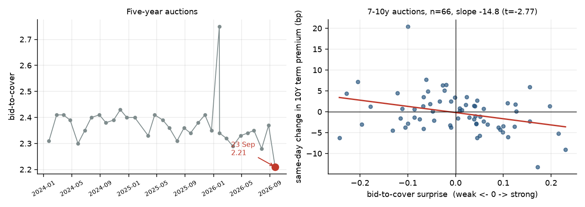

# Session log, 23 September 2026

What changed in the market, what I ran, what it did to the hypothesis list.

---

## The market

**The 10Y hit 5.104% today, +13bp, the biggest one-day move in about 18 months
and the highest since July 2007.** FRED has not published the CMT close yet, so
this is from press reporting and is not in any regression below. Named drivers:

- S&P services PMI jumped to **58.7** in September from 56.5, a near five-year
  high. Manufacturing **56.7**, a four-year high.
- Hawkish Fed commentary.
- **A weak five-year auction.**
- Oil up 2% on the day.

Since the 19 September session:

| | 9/18 | 9/21 | 9/22 |
|---|---|---|---|
| 2Y | 4.76 | 4.76 | 4.71 |
| 10Y | 5.01 | 4.96 | 4.96 |
| 30Y | 5.34 | 5.29 | 5.29 |
| WTI | 101.44 | 96.97 | 96.41 |
| VIX | 14.81 | 14.87 | 14.21 |
| USDJPY | 156.87 | - | - |

Two things worth noting. **Oil round-tripped**: 94.21 on 8 Sep, 107.02 on 15 Sep,
96.41 on 22 Sep. The whole Middle East supply spike unwound within two weeks as
diplomacy headlines came through. The 10Y did not round-trip with it, which is
mild evidence against the September selloff being an oil story.

And **the yen kept weakening to 156.87 despite both a BOJ hike to 1.25% and
coordinated US-Japan intervention**. Intervention plus tightening not holding the
currency is notable, though it is outside what this project tests.

No new USD deals from the five issuers. The only recent filing is Amazon's
11 September GBP offering, which supplies no Treasury duration and correctly
produces no signal from `signal_live.py`.

---

## What I ran: H11, auction demand

**Why.** In `03_FINDINGS.md` E3 I had withdrawn an argument. I claimed Treasury
coupon supply having a coefficient of −0.0014 (t = −0.15) was evidence against
duration absorption, then realised auction SIZES have been constant since
May 2026, so the regressor was near-constant and the null meant nothing.

Today's weak five-year is the prompt to fix that properly: stop using size, use
**demand**. Bid-to-cover, primary dealer take-up and the tail all vary auction to
auction even when size does not.

Predictions written before running: bid-to-cover coefficient **negative**, dealer
share **positive**, tail **positive**.

### The 23 September five-year in context

| Date | Size ($B) | Bid-to-cover | Dealer share | Surprise |
|---|---|---|---|---|
| 2026-06-24 | 70 | 2.35 | 0.112 | −0.045 |
| 2026-07-27 | 70 | 2.28 | 0.122 | −0.048 |
| 2026-08-26 | 70 | 2.37 | 0.089 | +0.052 |
| **2026-09-23** | **70** | **2.21** | **0.136** | **−0.117** |

Weakest five-year bid-to-cover in the 2024-2026 sample, 12.6th percentile of all
coupon auctions, with dealers taking the largest share since March.

### Results

| Measure | Coefficient | t | Verdict |
|---|---|---|---|
| bid-to-cover surprise | **−4.49** | −1.79 | right sign, marginal |
| bid-to-cover, with dealer share | **−6.81** | −1.96 | right sign |
| dealer share | +4.08 / −11.57 | 0.62 / −1.28 | sign flips, unusable |
| tail proxy | +0.178 | +3.74 | **contaminated, discarded** |
| size x weakness | +0.131 | +1.76 | right sign |

**Randomization test on bid-to-cover: p = 0.0705.** Observed −4.49 against a
placebo standard deviation of 2.50. That is the same marginal significance as the
AI issuance result (p = 0.069), which is a pleasing consistency.

**The AI coefficient is unaffected** by including auction demand: +0.0802
(t = 3.56). The two channels are not competing for the same variation.

### The tail was mechanical, for the fourth time

The tail proxy gave +0.178 with t = 3.74, which looked like the best result of
the day. It is contaminated. Regressing the tail on the same-day 10Y move gives
**R² = 0.390**. Because I measure the tail as the auction's clearing yield minus
the *previous* close, any day yields rose produces a positive tail whether the
auction was badly bid or not.

For contrast, the clean measures share almost nothing with the dependent
variable: bid-to-cover R² = 0.013, dealer share R² = 0.004.

This is the **fourth** instance of the same disease in this project, after the
concession estimator, the ACM-on-curve problem and the Japan pickup containing
UST10. Every time, the tell was a t-statistic that looked better than the honest
measures around it.

### Tenor specificity

| Auction tenor | Coefficient on bid-to-cover | t | n |
|---|---|---|---|
| 2-5y | −1.77 | −0.37 | 97 |
| **7-10y** | **−14.85** | **−2.77** | 66 |
| 20-30y | −0.02 | −0.01 | 66 |

The 10-year term premium responds to demand at 7-10y auctions and to nothing
else. That is the right kind of specificity given the dependent variable is
specifically the 10-year term premium, and it is a small irony that I can show
maturity matching on the Treasury side after proving it unmeasurable on the
corporate side.

Caveat: three tenor buckets is three more tests with no correction. At
Bonferroni the 7-10y result is around p = 0.02.

*Figure. Left: five-year bid-to-cover history with 23 September flagged. Right:
demand surprise against the same-day term premium change for 7-10y auctions.*

### Magnitude, against the corporate channel

| | Effect on 10Y term premium |
|---|---|
| 1 sd weaker auction (0.112 of bid-to-cover) | **+0.50 bp** |
| 23 September five-year (−0.117 surprise) | **+0.53 bp** |
| a $25B AI deal (~22 $bn 10y-equiv) | **+1.76 bp** |

Same order of magnitude. A jumbo AI deal is worth roughly three weak auctions.
But Treasury runs about **84 coupon auctions a year against 5.9 AI deals**,
roughly 14 times the event count, so the aggregate Treasury channel is much the
larger of the two even though each event is smaller.

---

## Status changes

**H4 rehabilitated and superseded by H11.** Treasury supply does move the term
premium, with the sign duration absorption predicts, at the same marginal
significance as the corporate channel. My withdrawn claim stays withdrawn, and
now there is a positive result in its place rather than an absence.

**The duration-absorption story is now three-for-three on sign.** Corporate
issuance adds duration and raises the term premium. Treasury buybacks remove it
and lower the term premium. Weak auction demand means duration is harder to place
and raises the term premium. Three different flows, three correct signs, all
marginal individually. The coherence is the evidence, not any single t-statistic.

**H8 (the oil story) is now partly testable and looks weak.** Oil round-tripped
94 to 107 to 96 while the 10Y went 4.80 to 5.01 and only came back to 4.96. If
oil drove the September long-end move, more of it should have reversed. Worth a
proper decomposition next session now that the full round trip is in the data.

### Decay: both transitory, different schedules

Ran the local projection on 7-10y auction weakness against the corporate one.
Normalised to each shock's own day-zero effect:

| h | auction, % of day 0 | AI issuance, % of day 0 |
|---|---|---|
| 0 | 100% | 100% |
| 1 | 50% | 95% |
| 2 | 47% | 142% |
| 3 | 24% | 77% |
| 5 | 34% | 14% |
| 10 | -100% | 18% |

Auction day-zero coefficient is +14.73 with t = 2.59; by h=1 it has halved.

The auction effect decays roughly twice as fast. That fits the plumbing: an
auction places its duration in one settlement, while a corporate deal has
bookbuilding, syndication and T+3 settlement, so the paper takes a few days to
find its home. The corporate impulse peaks at h=2 for the same reason.

Both are dead inside a week, which is the joint statement worth keeping:
duration absorption in the Treasury market is a matter of days, not a level.

Caveat: 7-10y was selected because that is where the cross-sectional result sat,
so this local projection is conditioned on a prior selection and its t-statistic
should be read as descriptive.

---

## Next

- Run the oil round-trip decomposition properly (H8).
- Refresh once FRED posts the 23 September close, and check whether the +13bp
  day is an outlier against the model or inside it.
